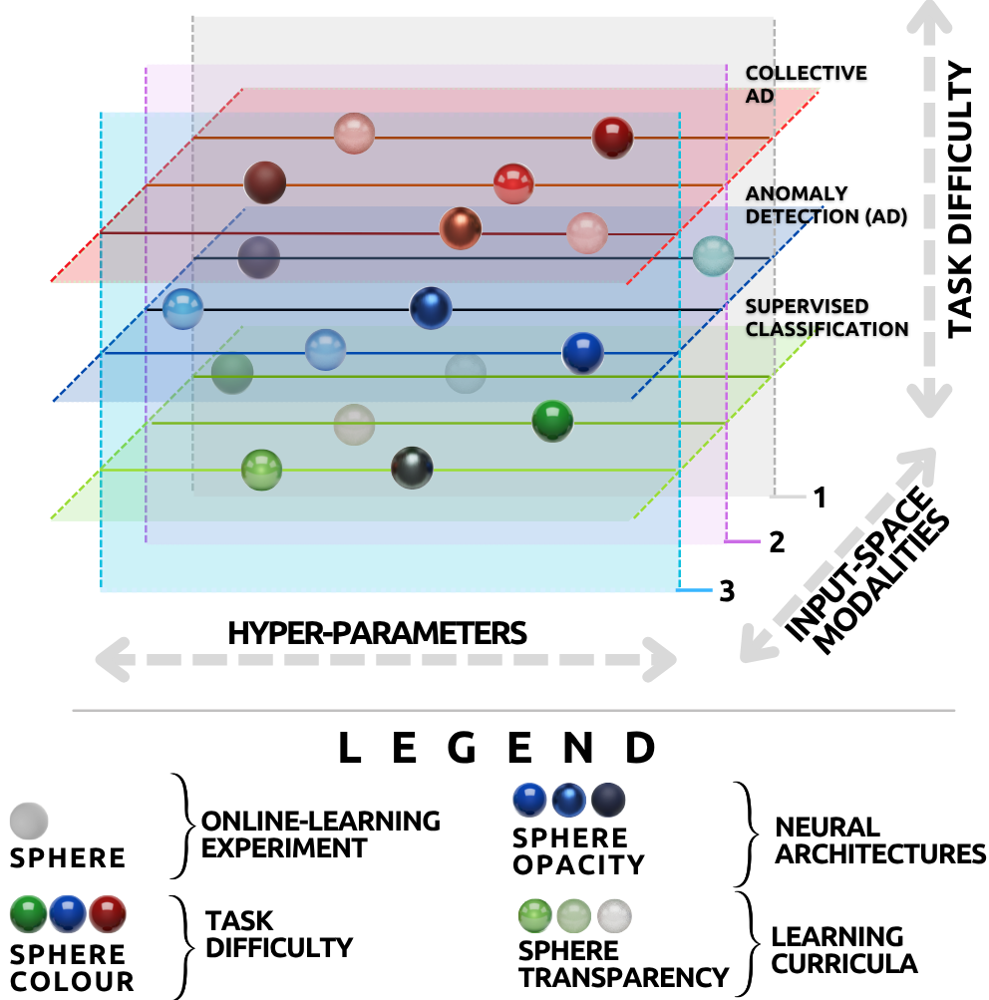
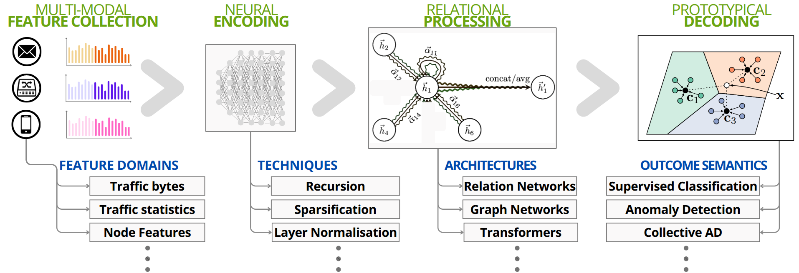

### 📖 Project page & figure-by-figure paper explainer → **https://dista-iot.github.io/insubria-smartville/**

# SmartVille — A framework for realistic Deep-Learning-based online network intrusion detection



**SmartVille is a *framework* — a scientific instrument for formulating, training and benchmarking neural intrusion detectors under online, open-world and multi-modal assumptions.** It is *not* a new stand-alone detector chasing leaderboard accuracy: the contribution is the research formulation and the reproducible methodology. This repository is the **open-source proof-of-concept implementation** of that framework, and it also carries the implementations of the (a) ASAP meta-learning setup, (b) the TIGER environment, and (c) the ACID active-defence agents. If you find it useful, [please cite us!](#citations)

## What the framework provides

SmartVille organises the deep-learning NID lifecycle around four ideas the offline literature usually skips:

- **Online learning as the default**, not an update phase bolted onto an offline pipeline — the detector begins inferring the moment traffic is observed and keeps learning while deployed.
- **Open-world assumptions** — previously unseen attack behaviours are expected to appear *after* deployment and must be organised, not just scored.
- **A multi-modal input design** — raw traffic bytes, traffic statistics and node-level measurements assembled as parallel online tensor streams.
- **An end-to-end differentiable Encode–Process–Decode (EPD) pipeline** — so different lightweight neural architectures can be swapped and benchmarked without bulky handcrafted preprocessing.

Two inference regimes are studied within the same framework: **supervised classification** (recognising known attack classes via prototypical learning) and **Collective Anomaly Detection** (relationally *clustering* concurrent, heterogeneous unknowns via differentiable kernel regression).



> 📖 **A full, figure-by-figure explainer of the paper is published as a GitHub Page:** https://dista-iot.github.io/insubria-smartville/

## Citations
    @article{cevallos2026smartville,
        title = {SmartVille: A Framework for Realistic Deep Learning-based Online Network Intrusion Detection},
        author = {Cevallos M., Jes\'us F. and Rizzardi, Alessandra and Sicari, Sabrina and Coen-Porisini, Alberto},
        journal = {Journal of Network and Systems Management},
        year = {2026},
        note = {In press},
        publisher = {Springer}
        }

    @article{cevallos2024asap,
        title={ASAP: Automatic Synthesis of Attack Prototypes, an online-learning, end-to-end approach},
        author={Cevallos, Jesus and Rizzardi, Alessandra and Sicari, Sabrina and Porisini, Alberto Coen and others},
        journal={Computer Networks},
        pages={110828},
        year={2024},
        publisher={Elsevier}
        }

    @misc{cevallos2024tiger,
        title = {TIGER: an open-source cyber-Threat Intelligence Game Environment for Reinforcement learning},
        author = {Cevallos, Jesus and Rizzardi, Alessandra and Sicari, Sabrina and Coen-Porisini, Alberto},
        year = {2024}, 
        url = {https://github.com/DISTA-IoT/insubria-smartville},
        note = {Accessed: YYYY-MM-DD} 
        }

    @misc{cevallos2025acid,
        title = {ACID: beta-testing ACtive Inference for active cyber-Defence.},
        author = {Cevallos, Jesus and Rizzardi, Alessandra and Sicari, Sabrina and Coen-Porisini, Alberto},
        year = {2025}, 
        url = {https://github.com/DISTA-IoT/insubria-smartville},
        note = {Accessed: YYYY-MM-DD} 
        }

## Overview

This repository is the open-source, proof-of-concept **implementation** of the SmartVille framework, built on GNS3, PyTorch and Docker for training and evaluating online, machine-learning-based intrusion detection under realistic network conditions. It should be read as *one concrete realisation* of the framework's requirements — online learning, multi-modal observation and continual incorporation of new threat intelligence — rather than as the primary contribution of the paper.

- The framework paper *"SmartVille: A Framework for Realistic Deep Learning-based Online Network Intrusion Detection"* has been **accepted (in press, 2026) at the Journal of Network and Systems Management**.

- SmartVille also instantiates the **ASAP** meta-learning setup for automatic synthesis of attack prototypes, described in the companion paper *"ASAP: Automatic Synthesis of Attack Prototypes, an Online-Learning, End-to-End Approach"* (Computer Networks, 2024).

If you find our work useful, [please cite us!](#citations)

**Feel free to contribute!**


## Table of Contents


- [Installation](#installation)
- [Usage](#usage)
- [Troubleshooting](#troubleshooting)
- [Background](#background)
- [License](#license)

## Installation
### Setting Up the Program on a Native Linux Distribution or WSL
This guide provides step-by-step instructions for setting up the testbed on a native Linux distribution. We have not verified if it works on the Windows Subsystem for Linux (WSL).

### GNS3 
Install the GNS3 software following the official documentation at:
https://docs.gns3.com/docs/getting-started/installation/linux/

Start the server either via GUI or by running 

    gns3server

the server will run on *localhost:3080* as default.

- THIS PROJECT HAS BEEN TESTED ON GNS3 VERSION 2.2.54

### Dependencies


Make sure you have Python installed. You can download it from [python.org](https://www.python.org/downloads/).

- THIS PROJECT HAS BEEN TESTED ON PYTHON 3.12.3

#### Setting up a Virtual Environment

1. **Navigate to the Project Directory**:
   
   Open your terminal and change to your project directory where you want to set up the virtual environment.
   
   ```sh
   cd path/to/your/smartville_folder
   ```

2. **Create the Virtual Environment**:
   
   Use the `venv` module to create a virtual environment. Replace `venv` with your preferred name for the environment.

   ```sh
   python -m venv .venv
   ```

3. **Activate the Virtual Environment**:
   
     
     ```sh
     source .venv/bin/activate
     ```

   After activation, your terminal should show the virtual environment name in the prompt, indicating it's active.

4. **Install the Required Packages**:

   With the virtual environment active, install the necessary packages using the `requirements.txt` file.

   ```sh
   pip install -r requirements.txt
   ```

#### Notes

- Ensure that you always activate the virtual environment before running any scripts or installing new packages.
- You can check if the virtual environment is activated by looking at your terminal prompt; it should show `(smartville_venv)` or your environment's name.


### Docker Images
YOU NEED DOCKER TO RUN THIS PROJECT. 

Before starting, create a file named .env in your projects home dir and put there your wandb api key:

    #.env file content (place it in the same dir of this readme file)
    
    WANDB_API_KEY=pastehereyourwandbapikey
   
    


The docker images used to build the nodes can be obtained by running the Makefile

    # Build the docker images

    $ make all

    # note there is a cache point for building from the git cloning for some containers:
    
    make build-scache

### Build topology
After building the images, you can build the *star topology*:


    # (NOTE: GNS3 MUST BE OPENED!)

    $ python3 utils/star_topology.py

You will get a new project in your gns3 server.

Note: Hydra is used to override the config file. Use an override configuration for different topologies, e.g, for the latest config:


    $ python3 utils/star_topology.py override=acid


You can change the topology by modifying the topology creator script.

If needed, fill the *ADDITIONAL_ENV_VARS* option in the config file, for example:

    in your_overrides.yaml:

    topology_creator:
        ADDITIONAL_ENV_VARS: |
            https_proxy=http://proxy.uninsubria.it:3128
            HTTPS_PROXY=http://proxy.uninsubria.it:3128
            HTTP_PROXY=http://proxy.uninsubria.it:3128
            http_proxy=http://proxy.uninsubria.it:3128
            no_proxy=localhost,127.0.0.1,${topology_creator.bridge_ip}

Note that such a parameter is a string and is formatted diversely comparted to yaml's default dicts...

### Dashboard

Execute the dash script and it will guide you through the rest! (use overrides if you want the last version!)

    python3 dashboard/dash.py override=acid

You can now control everthing from your dashboard, which will be available at http://localhost:7777 (you can change the ip and port in the config file, e.g. you can connect to a different machine via ssh tunneling).

### Dashboard CLI client

If you prefer a terminal workflow, you can use `dashboard/dash_cli.py` to send the same HTTP requests used by the web GUI (`dashboard/static/js/dash.js`), while keeping a persistent local configuration generated from Hydra.

```sh
# initialize local CLI config from Hydra default + optional profile override
python3 dashboard/dash_cli.py --profile acid init-config

# inspect and edit persisted config values
python3 dashboard/dash_cli.py show-config
python3 dashboard/dash_cli.py set intrusion_detection.agent DAI_A
python3 dashboard/dash_cli.py set health.probe_metrics.RAM true

# experiment lifecycle
python3 dashboard/dash_cli.py refresh-containers
python3 dashboard/dash_cli.py start-experiment
python3 dashboard/dash_cli.py start-traffic
python3 dashboard/dash_cli.py check-traffic
python3 dashboard/dash_cli.py stop-traffic
python3 dashboard/dash_cli.py stop-experiment

# monitor the active W&B run metrics (reads WANDB_API_KEY from .env or env vars)
python3 dashboard/dash_cli.py wandb-monitor
python3 dashboard/dash_cli.py wandb-monitor --watch --interval-secs 15
# optional advanced networking knobs for slow/proxy networks:
python3 dashboard/dash_cli.py wandb-monitor --wandb-timeout-secs 60 --wandb-retries 4 --wandb-endpoint https://api.wandb.ai/graphql

# delayed runner:
# waits 2h, initializes dista_tiger, forces DQN, starts experiment+traffic,
# waits 3h, then stops experiment.
python3 dashboard/dash_cli_dista_tiger_delayed.py
```

By default, CLI state is saved in `~/.smartville/dash_cli_state.yaml`. If `--base-url` is omitted, `dash_cli.py` now inherits the URL from Hydra config (`host_ip` + `dashboard_port`, including selected profile/overrides). You can still override URL and state path explicitly with `--base-url` and `--state-file`.

### Smart Controller

For ease-of-experimenting, our current release of the smart controller node does not run automatically at the container's boot, so youll need to issue from your host:

    # to open a terminal
    docker exec -it <controller_container_name_or_id> /bin/bash

    # in the container shell, run this to run the server that accepts commands:
    ../../pox.py smartController.tiger_server.py

    # notice you could use Vscode debug functionalities, the configs for this are actually versioned...

    # Wait for the server to be ready before sending the initialisation command from the dashboard!!
    # you should see something like:

            POX 0.7.0 (gar) / Copyright 2011-2020 James McCauley, et al.
            [version                ] Support for Python 3 is experimental.
            [core                   ] POX 0.7.0 (gar) is up.
            [openflow.of_01         ] [8a-20-7b-fd-e3-4e 1] connected
            [TigerServer            ] Connection is UP
            [TigerServer            ] TigerServer API is starting...
            INFO:     Started server process [1168169]
            INFO:     Waiting for application startup.
            INFO:     Application startup complete.
            INFO:     Uvicorn running on http://0.0.0.0:7777 (Press CTRL+C to quit)

    # Then you can issue the initialisation command from the dashboard, and the start stop traffic commands... (do it AFTER initialisation!)

Stay tuned for a full walk-through tutorial!


## Troubleshooting
### gns3_server.conf is not found
The file "gns3_server.conf" which contains GNS3's setup configuration should be generated automatically during GNS3 installation.However it's a known issue that this may not happen. 
The script *generate_default_conf.sh* can be run in terminal via:

    sh generate_default_conf.sh

It creates the default configration file in the default directory for linux *$HOME/.config/GNS3/2.2/*.

## Background
### SDN and OpenFlow characteristics

Networking environments are composed of a data plane, responsible for forwarding packets, and a control plane, responsible for determining how packets are forwarded. To illustrate the difference between SDN and traditional networking, consider the following example. If Alice wants to email Bob, Alice’s router will forward the packets (data plane) according to its routing table (control plane) to Bob’s router. In traditional networking, the data and control planes reside on the same device, whereas in SDN, a separate "layer" known as the controller is added between the data plane and the control plane. The controller acts as a centralized intelligence that specifies how the nodes must handle the packets.

There are four types of interactions in SDN. The controller interacts with the application plane through the so-called Northbound APIs. Through these APIs, applications communicate network resource requisites (data, storage, bandwidth, etc.) so the network can be configured accordingly. Northbound APIs should adhere to the REST criteria.

On the other hand, the controller interacts with the network forwarding elements (data plane) through the Southbound APIs, which allow the controller to send commands directly to the nodes. Protocols such as Openflow and NETCONF were created for this purpose. Third, interactions between SDN and traditional networks are made possible via the Westbound APIs that use hybrid solutions such as SDN-IP, RouteFlow, and BTSDN. Lastly, interactions from SDN to SDN are made possible via the Eastbound APIs that use protocols such as Hyperflow and Onix.

### Docker containers
A Docker container characterizes each node in the SmartVille testbed. The container images are buildable using the correspondent Dockerfiles that handle all the dependencies and the nodes' internal file-system structure.

This example of code represents the .Dockerfile of each victim node. It's possible to identify four main docker containers in our testbed.

- Controller: all the dependencies to run the controller and a suite of networking tools are installed. The POX library and pytorch are retrieved and set to the gar-experimental branch. Kafka, Grafana, Prometheus tools are retrieved and ports 9090, 9092, 3000 are exposed to allow the instance of the three servers, lastly the script entrypoint.sh, which keeps the application alive is run.
- Victim: all the dependencies to run the victim behavior are installed (python3, TCP Replay, scapy, kafka, network tools) and the victim's scripts are imported in the file system.
- Attacker: all the dependencies to run the attacker behavior are installed (python3,TCP Replay, scapy, kafka, network tools) and the scripts of the different cyber attacks are copied in the file system.
- Switch: the container of the OpenVSwitch is based on the official GNS3 OpenVSwitch appliance. However, the boot kernel has been modified to suit our application scenario via the boot.sh script.

The Docker containers can be modified to match the configuration of every desired device that needs to be emulated in the network topology.

### OpenFlow Switch
The OpenVSwitch is based on the GNS3 appliance, but the boot kernel is being modified at launch by the boot.sh script:

The last part of the script is the one that sets the switch to listen for a controller on physical port br0 with IP address 192.168.1.1 port 6633. This part can be modified to fit the desired IP range case scenario.

OpenFlow switches operate based on a set of high-level commands defined by the OpenFlow protocol, providing a flexible and programmable approach to network management. When an OpenFlow controller issues OpenFlow commands, such as flow table modifications or routing instructions, the switch processes these directives to define its forwarding behavior. The switch maintains a flow table that stores rules specifying how to handle incoming packets. Each rule is characterized by a set of fields that identify the sender, the receiver, the used communication protocol, and a set of actions to do when the switch receives a packet that matches those fields. Each time a packet is received by the switch, it consults its flow table to determine the appropriate action to perform, such as forwarding, dropping, or modifying the packet. 

If none of the rules matches the packet's parameters, a flow miss occurs. The packet is sent to the controller, which has to build and send back an appropriate OpenFlow command to the switch. This ensures that the next time a similar packet arrives, it will trigger a flow hit and be handled directly by the switch. This paradigm allows for dynamic network behavior adjustments, as the controller can remotely instruct switches to adapt to changing network conditions. OpenFlow's separation of the control and data planes empowers administrators to centrally manage and orchestrate network policies, enabling agility and responsiveness in modern network infrastructures.

### IoT traffic Details
The Aposemat IoT23 dataset was used in our work to reproduce realistic IoT attack and honeypot patterns. The following attacks were extracted from the original Pcap files that are publicly available. Unless explicitly stated diversely, we extracted these flows using the attacker origin IP address as the filtering criterion. Recall that source and destination IP addresses and transport-layer ports were online masked before feeding the neural modules with raw packet bytes.

- Hajime: This Trojan malware searches to exploit Linux-related vulnerabilities. It was extracted from the dataset's capture 9.1. We extracted 5e4 flows.
- Hakai: This is a distributed denial-of-service (DDoS) botnet, a specialization of the Mirai and Gafgyt malware. (Extracted from dataset's capture 8.1.) 1.2e4 flows were extracted.
- Gafgyt: This is another more general DDoS botnet. (Dataset's capture 60.1.) 5e4 flows extracted.
- Mirai: This is an open-source DDoS attack specially used over IoT devices. Capture: 34.1. Flows: 2.4e4.
- Torii: A Command and Conquer (C&C) and Information Gathering malware. Capture: 20.1. Flows extracted: 5e4.
- Muhstik: A worm based on the Mirai Botnet. Among others, it targets IoT devices. Commonly used to mine cryptocurrency and perform DDoS attacks. Capture: 3.1. Flows extracted: 5e4.
- Okiru: Another C&C Botnet that targets ARC processors, commonly used in wearables, and medical IoT, among others. Capture 7.1. Flows extracted: 5e4. The criteria for extracting these attack flows included target source and destination transport ports.
- Horizontal Scan: 5e4 traffic flows related to generic Horizontal Scan (HScan) were extracted from dataset's capture 1.1.
- C&C HeartBeat: Generic heartbeat-related server-side flows were also extracted in the context of the C&C traffic. Capture 7.1. Flows extracted: 0.15e4.
- Generic DDoS: Also, a set of 5e4 generic DDoS-related flows were extracted in the context of the C&C traffic from capture 7.1.

The Honeypot devices used by the authors of the IoT23 captures were used in our cyber-ranch to emulate honeypot IoT devices used as attack victims. More specifically, these honeypots were the following:

- Somfy door lock device: All the flows contained in the first three captures of folder Honeypot7.1 were extracted. These flows are related to a smart door lock device. In our topology, two nodes reproduced these flows.
- Philips HUE smart LED lamp: These flows were extracted from the folder Honeypot4.1. One node reproduced these flows in our topology.
- Amazon Echo home intelligent personal assistant: These flows were extracted from the folder Honeypot5.1. One node reproduced these flows in our topology.

The interested reader is referred to for more details on these captures. All the flow extraction code is open-sourced alongside the testbed.

### Grafana, Kafka, Prometheus
Apache Kafka is a distributed data streaming platform commonly referred to as a messaging system. It is capable of publishing messages, storing and processing records in real-time. Kafka handles immense volumes of data where multiple clients can consume or publish messages on its topics. In our testbed, it's used by the nodes that act as producers to send information related to their CPU, RAM, and network-related metrics while creating a new topic for each of them. The controller will then connect as a consumer to the Kafka server to consume this data.

Prometheus is a system for monitoring systems and services. It collects metrics from configured targets at defined intervals, evaluates rule expressions, displays the results, and can trigger alerts when specified conditions are observed. In our work, Prometheus is used to guarantee the persistence of data. All the information sent to the Kafka server is saved into a NoSQL database by Prometheus.

Grafana is an interactive open-source data visualization platform developed by Grafana Labs. It allows users to view data through unified tables and charts on a single or multiple dashboards, making interpretation and understanding easier. In our work, Grafana and Prometheus work in tandem. Once the data is saved persistently by Prometheus, it's then retrieved by Grafana to build and show a comprehensive dashboard of each topic to the user.


As a result of these system interactions, the user can view a dashboard of the devices' status in the network. The persistent data is then made available for further usage by the controller.

### Prototypical Networks (PN)
Prototypical Networks (PN) offer a neural architectural strategy that decouples the classification task from the singular distributions of classes. PN can be considered representational machinery that learns a proto-distribution from which every class distribution is generated. Not only do PNs achieve learning efficiency, but the inherent geometrical inductive biases produce latent class prototypes that can be further used for discriminative tasks.

PNs are trained through episodic learning: Given in input a set of query and support latent samples, PNs make a multiclass classification inference for each one of the former as a function of the labels of the latter: Let the input batch be represented by 𝓑 = {𝓑𝓢 ∪ 𝓑𝓠} where 𝓑𝓢 is the set of support latent vectors 𝐳𝐬1, 𝐳𝐬2, …, 𝐳𝐬|𝓑𝓢| and 𝓑𝓠 is the set of query latent vectors 𝐳𝐪1, 𝐳𝐪2, …, 𝐳𝐪|𝓑𝓠|. The class-wise centroids or prototypes are computed using the support latents:


where 𝑁𝑖 is the number of support latents in class 𝑖 and 𝓒 is the set of classes included in 𝓑.

Successively, PNs build a classification logits vector for each query sample where the vector components are the association scores to each class. These scores are inversely proportional to the Euclidean distances between the latent representation of the query sample and the correspondent class prototype. The neural modules of the SmartController implemented in SmartVille are those of ASAP that use PNs to perform multi-class classification of attacks. By doing so, the class prototypes learnt in the PN framework are mapped to latent attack signatures. For more information on the prototypical classification mechanism in our neural modules, the reader is referred to ASAP.

## License

Apache License
Version 2.0, January 2004
http://www.apache.org/licenses/

TERMS AND CONDITIONS FOR USE, REPRODUCTION, AND DISTRIBUTION

1. Definitions.

    "License" shall mean the terms and conditions for use, reproduction, and distribution as defined by Sections 1 through 9 of this document.

    "Licensor" shall mean the copyright owner or entity authorized by the copyright owner that is granting the License.

    "Legal Entity" shall mean the union of the acting entity and all other entities that control, are controlled by, or are under common control with that entity. For the purposes of this definition, "control" means (i) the power, direct or indirect, to cause the direction or management of such entity, whether by contract or otherwise, or (ii) ownership of fifty percent (50%) or more of the outstanding shares, or (iii) beneficial ownership of such entity.

    "You" (or "Your") shall mean an individual or Legal Entity exercising permissions granted by this License.

    "Source" form shall mean the preferred form for making modifications, including but not limited to software source code, documentation source, and configuration files.

    "Object" form shall mean any form resulting from mechanical transformation or translation of a Source form, including but not limited to compiled object code, generated documentation, and conversions to other media types.

    "Work" shall mean the work of authorship, whether in Source or Object form, made available under the License, as indicated by a copyright notice that is included in or attached to the work (an example is provided in the Appendix below).

    "Derivative Works" shall mean any work, whether in Source or Object form, that is based on (or derived from) the Work and for which the editorial revisions, annotations, elaborations, or other modifications represent, as a whole, an original work of authorship. For the purposes of this License, Derivative Works shall not include works that remain separable from, or merely link (or bind by name) to the interfaces of, the Work and Derivative Works thereof.

    "Contribution" shall mean any work of authorship, including the original version of the Work and any modifications or additions to that Work or Derivative Works thereof, that is intentionally submitted to Licensor for inclusion in the Work by the copyright owner or by an individual or Legal Entity authorized to submit on behalf of the copyright owner. For the purposes of this definition, "submitted" means any form of electronic, verbal, or written communication sent to the Licensor or its representatives, including but not limited to communication on electronic mailing lists, source code control systems, and issue tracking systems that are managed by, or on behalf of, the Licensor for the purpose of discussing and improving the Work, but excluding communication that is conspicuously marked or otherwise designated in writing by the copyright owner as "Not a Contribution."

    "Contributor" shall mean Licensor and any individual or Legal Entity on behalf of whom a Contribution has been received by Licensor and subsequently incorporated within the Work.

2. Grant of Copyright License. Subject to the terms and conditions of this License, each Contributor hereby grants to You a perpetual, worldwide, non-exclusive, no-charge, royalty-free, irrevocable copyright license to reproduce, prepare Derivative Works of, publicly display, publicly perform, sublicense, and distribute the Work and such Derivative Works in Source or Object form.

3. Grant of Patent License. Subject to the terms and conditions of this License, each Contributor hereby grants to You a perpetual, worldwide, non-exclusive, no-charge, royalty-free, irrevocable (except as stated in this section) patent license to make, have made, use, offer to sell, sell, import, and otherwise transfer the Work, where such license applies only to those patent claims licensable by such Contributor that are necessarily infringed by their Contribution(s) alone or by combination of their Contribution(s) with the Work to which such Contribution(s) was submitted. If You institute patent litigation against any entity (including a cross-claim or counterclaim in a lawsuit) alleging that the Work or a Contribution incorporated within the Work constitutes direct or contributory patent infringement, then any patent licenses granted to You under this License for that Work shall terminate as of the date such litigation is filed.

4. Redistribution. You may reproduce and distribute copies of the Work or Derivative Works thereof in any medium, with or without modifications, and in Source or Object form, provided that You meet the following conditions:

    (a) You must give any other recipients of the Work or Derivative Works a copy of this License; and

    (b) You must cause any modified files to carry prominent notices stating that You changed the files; and

    (c) You must retain, in the Source form of any Derivative Works that You distribute, all copyright, patent, trademark, and attribution notices from the Source form of the Work, excluding those notices that do not pertain to any part of the Derivative Works; and

    (d) If the Work includes a "NOTICE" text file as part of its distribution, then any Derivative Works that You distribute must include a readable copy of the attribution notices contained within such NOTICE file, excluding those notices that do not pertain to any part of the Derivative Works, in at least one of the following places: within a NOTICE text file distributed as part of the Derivative Works; within the Source form or documentation, if provided along with the Derivative Works; or, within a display generated by the Derivative Works, if and wherever such third-party notices normally appear. The contents of the NOTICE file are for informational purposes only and do not modify the License. You may add Your own attribution notices within Derivative Works that You distribute, alongside or as an addendum to the NOTICE text from the Work, provided that such additional attribution notices cannot be construed as modifying the License.

    You may add Your own copyright statement to Your modifications and may provide additional or different license terms and conditions for use, reproduction, or distribution of Your modifications, or for any such Derivative Works as a whole, provided Your use, reproduction, and distribution of the Work otherwise complies with the conditions stated in this License.

5. Submission of Contributions. Unless You explicitly state otherwise, any Contribution intentionally submitted for inclusion in the Work by You to the Licensor shall be under the terms and conditions of this License, without any additional terms or conditions. Notwithstanding the above, nothing herein shall supersede or modify the terms of any separate license agreement you may have executed with Licensor regarding such Contributions.

6. Trademarks. This License does not grant permission to use the trade names, trademarks, service marks, or product names of the Licensor, except as required for reasonable and customary use in describing the origin of the Work and reproducing the content of the NOTICE file.

7. Disclaimer of Warranty. Unless required by applicable law or agreed to in writing, Licensor provides the Work (and each Contributor provides its Contributions) on an "AS IS" BASIS, WITHOUT WARRANTIES OR CONDITIONS OF ANY KIND, either express or implied, including, without limitation, any warranties or conditions of TITLE, NON-INFRINGEMENT, MERCHANTABILITY, or FITNESS FOR A PARTICULAR PURPOSE. You are solely responsible for determining the appropriateness of using or redistributing the Work and assume any risks associated
